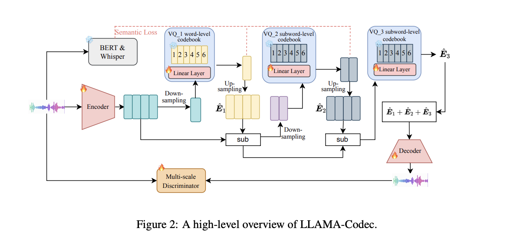

# Towards Few-shot Audio Task Learners with LLAMA-Codec: A Preliminary Study
This Repository provides a language-driven audio codec model (LLAMA-Codec), which can be used to build multi-modal LLMs (text and audio modalities). The details and paper will be released as soon as possible.

## Introduction
In this study, we raise two fundamental questions in the audio research community: (1) whether exploring few-shot task learners (or in-context learning) is promising and beneficial for the audio research and application community. (2) if the answer is positive, how to build a model that has in-context ability in the audio domain. For the first question, we hold a positive attitude to build a few-shot audio task learners, especially, when we see the success of large-language models (LLMs) and multi-modal large-language models. We leave a deeper discussion for the first problem in the audio research community. We focus on giving a preliminary study for the second question. Firstly, we propose to bridge the gap between text and audio modalities by learning a language-driven audio codec model (LLAMA-Codec). After that, LLAMA-Codec can be used to transfer the audio modality into the same representation space with text, which provides an opportunity to directly use the in-context learning ability of pre-trained LLMs to solve audio tasks in a few-shot style. Specifically, we directly use the vocabulary of LLAMA2 as the codebooks of audio codec and train VQ-VAE style codec models. We demonstrate that the LLAMA-Codec not only possesses strong reconstruction abilities for audio data, but is also well-suited to serve as a connector between audio and text modalities. Experimentally, we show it can solve many audio understanding and generation tasks in a few-shot way without any fine-tuning, such as speech emotion classification, speech command recognition, audio classification, and simple text-to-speech generation text-to-sound generation, and speech denoising. To facilitate research on few-shot audio task learning and multi-modal LLMs, we have open-sourced the LLAMA-Codec model.



More details will be introduced as soon as.

## How to use LLAMA-Codec?
step 1:
```
wegt https://huggingface.co/Dongchao/UniAudio/resolve/main/ckpt_00145000.pth
```
Step 2: Download LLAMA 2 7B based on https://github.com/meta-llama/llama-recipes/tree/main <br>
Step 3: refer to infer.py
```
python infer.py
```


### Acknowledgements
https://github.com/descriptinc/descript-audio-codec 
https://github.com/yangdongchao/AcademiCodec
https://github.com/hubertsiuzdak/snac
https://github.com/Meta-Llama/llama-recipes

